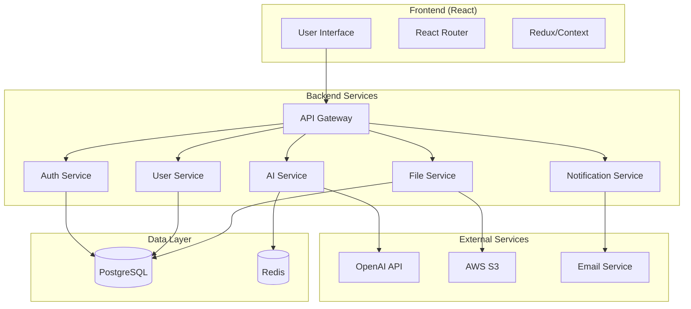

# Дизайн-документ: Веб-приложение "Мой личный косметолог"

## Обзор

Веб-приложение "Мой личный косметолог" представляет собой полнофункциональную платформу для получения персонализированных рекомендаций по уходу за кожей. Система использует современные технологии AI для анализа проблем пользователей и предоставления профессиональных советов, адаптированных под индивидуальные потребности.

## Архитектура

### Общая архитектура системы



### Технологический стек

**Frontend:**
- React 18 с TypeScript
- Redux Toolkit для управления состоянием
- React Router для навигации
- Material-UI или Chakra UI для компонентов
- React Query для кэширования API запросов
- i18next для многоязычности

**Backend:**
- Node.js 18+ с TypeScript
- Express.js фреймворк
- Prisma ORM для работы с БД
- JWT для аутентификации
- Multer для загрузки файлов
- Socket.io для чата в реальном времени

**База данных:**
- PostgreSQL 14+ (основная БД)
- Redis 7+ (кэширование и сессии)

**Внешние сервисы:**
- OpenAI API (GPT-4 и Vision)
- AWS S3 (хранение файлов)
- SendGrid/Mailgun (email уведомления)

## Компоненты и интерфейсы

### Frontend компоненты

#### Основные страницы
1. **HomePage** - Главная страница с описанием сервиса
2. **AuthPage** - Регистрация и авторизация
3. **ProfilePage** - Профиль пользователя
4. **ConsultationPage** - Форма консультации
5. **RecommendationsPage** - Отображение рекомендаций
6. **HistoryPage** - История запросов
7. **CalendarPage** - Календарь ухода
8. **ProgressPage** - Отслеживание прогресса
9. **ChatPage** - Чат с AI-косметологом

#### Переиспользуемые компоненты
- **Header** - Навигация и переключение языка
- **Sidebar** - Боковое меню
- **LoadingSpinner** - Индикатор загрузки
- **ErrorBoundary** - Обработка ошибок
- **ImageUpload** - Загрузка фотографий
- **Calendar** - Интерактивный календарь
- **Chart** - Графики прогресса

### Backend API эндпоинты

#### Аутентификация
```
POST /api/auth/register - Регистрация
POST /api/auth/login - Авторизация
POST /api/auth/logout - Выход
POST /api/auth/refresh - Обновление токена
POST /api/auth/forgot-password - Восстановление пароля
POST /api/auth/reset-password - Сброс пароля
```

#### Пользователи
```
GET /api/users/profile - Получение профиля
PUT /api/users/profile - Обновление профиля
DELETE /api/users/profile - Удаление аккаунта
POST /api/users/upload-avatar - Загрузка аватара
```

#### AI-консультации
```
POST /api/consultations - Создание консультации
GET /api/consultations - Список консультаций
GET /api/consultations/:id - Получение консультации
DELETE /api/consultations/:id - Удаление консультации
POST /api/consultations/analyze-image - Анализ фото
```

#### Чат
```
GET /api/chat/history - История чата
POST /api/chat/message - Отправка сообщения
WebSocket /api/chat/ws - Реальное время
```

#### Календарь и прогресс
```
GET /api/calendar/events - События календаря
POST /api/calendar/events - Создание события
PUT /api/calendar/events/:id - Обновление события
DELETE /api/calendar/events/:id - Удаление события

GET /api/progress/photos - Фото прогресса
POST /api/progress/photos - Загрузка фото
GET /api/progress/diary - Дневник состояния
POST /api/progress/diary - Запись в дневник
```

## Модели данных

### User (Пользователь)
```typescript
interface User {
  id: string;
  email: string;
  passwordHash: string;
  firstName: string;
  lastName: string;
  avatar?: string;
  language: 'ru' | 'en';
  createdAt: Date;
  updatedAt: Date;
  profile: UserProfile;
}
```

### UserProfile (Профиль пользователя)
```typescript
interface UserProfile {
  id: string;
  userId: string;
  age?: number;
  skinType: 'oily' | 'dry' | 'combination' | 'normal' | 'sensitive';
  allergies: string[];
  skinSensitivity: 'low' | 'medium' | 'high';
  currentProblems: string[];
  skinGoals: string[];
  createdAt: Date;
  updatedAt: Date;
}
```

### Consultation (Консультация)
```typescript
interface Consultation {
  id: string;
  userId: string;
  query: string;
  language: 'ru' | 'en';
  recommendations: Recommendation;
  images?: string[];
  status: 'pending' | 'completed' | 'failed';
  createdAt: Date;
  updatedAt: Date;
}
```

### Recommendation (Рекомендация)
```typescript
interface Recommendation {
  id: string;
  consultationId: string;
  morningRoutine: RoutineStep[];
  eveningRoutine: RoutineStep[];
  additionalAdvice: string[];
  productRecommendations: ProductRecommendation[];
  warnings: string[];
  createdAt: Date;
}

interface RoutineStep {
  step: number;
  name: string;
  description: string;
  frequency: string;
  products: string[];
}

interface ProductRecommendation {
  category: string;
  type: string;
  ingredients: string[];
  examples: ProductExample[];
}

interface ProductExample {
  name: string;
  brand: string;
  priceCategory: 'budget' | 'mid' | 'premium';
  whereToFind: string[];
}
```

### ChatMessage (Сообщение чата)
```typescript
interface ChatMessage {
  id: string;
  userId: string;
  message: string;
  response?: string;
  images?: string[];
  timestamp: Date;
}
```

### CalendarEvent (События календаря)
```typescript
interface CalendarEvent {
  id: string;
  userId: string;
  title: string;
  description?: string;
  date: Date;
  time?: string;
  type: 'routine' | 'reminder' | 'appointment';
  completed: boolean;
  createdAt: Date;
}
```

### ProgressPhoto (Фото прогресса)
```typescript
interface ProgressPhoto {
  id: string;
  userId: string;
  imageUrl: string;
  description?: string;
  tags: string[];
  date: Date;
  createdAt: Date;
}
```

### DiaryEntry (Запись дневника)
```typescript
interface DiaryEntry {
  id: string;
  userId: string;
  date: Date;
  skinCondition: number; // 1-10
  notes?: string;
  symptoms: string[];
  productsUsed: string[];
  createdAt: Date;
}
```

## Свойства корректности

*Свойство - это характеристика или поведение, которое должно выполняться во всех допустимых выполнениях системы - по сути, формальное утверждение о том, что система должна делать. Свойства служат мостом между человекочитаемыми спецификациями и машинно-проверяемыми гарантиями корректности.*

### Свойство 1: AI-интеграция и многоязычность
*Для любого* запроса пользователя на русском или английском языке, система должна успешно интегрироваться с OpenAI API и возвращать рекомендации на том же языке, что и запрос
**Validates: Requirements US-001, US-011**

### Свойство 2: Аутентификация и безопасность сессий
*Для любого* валидного email и пароля, система должна успешно создавать аккаунт, авторизовывать пользователя и поддерживать защищенную сессию с корректным управлением токенами
**Validates: Requirements US-002**

### Свойство 3: Управление профилем пользователя
*Для любых* данных профиля пользователя, система должна корректно сохранять, извлекать и обновлять информацию, обеспечивая round-trip консистентность данных
**Validates: Requirements US-003**

### Свойство 4: Структура рекомендаций
*Для любого* запроса о проблемах кожи, система должна возвращать структурированные рекомендации, содержащие утренний и вечерний уход с обязательными этапами (очищение, тонизирование, сыворотки, увлажнение, защита) и частотой применения для каждого средства
**Validates: Requirements US-004**

### Свойство 5: Полнота продуктовых рекомендаций
*Для любых* рекомендаций по продуктам, система должна включать описание типов средств, активных ингредиентов, конкретные примеры продуктов с брендами и ценовые категории
**Validates: Requirements US-005**

### Свойство 6: Управление историей запросов
*Для любого* пользователя, система должна сохранять все запросы с датами, обеспечивать доступ к полным рекомендациям из истории и поддерживать поиск по сохраненным данным
**Validates: Requirements US-006**

### Свойство 7: Управление календарными событиями
*Для любого* пользователя, система должна поддерживать создание, редактирование, удаление событий календаря, добавление напоминаний и отметки о выполнении процедур
**Validates: Requirements US-007**

### Свойство 8: Отслеживание прогресса
*Для любого* пользователя, система должна поддерживать загрузку фотографий прогресса, ведение дневника состояния кожи с оценками и генерацию графиков прогресса на основе введенных данных
**Validates: Requirements US-008**

### Свойство 9: AI-анализ изображений
*Для любого* загруженного изображения кожи, система должна успешно выполнять AI-анализ через OpenAI Vision API, генерировать рекомендации на основе визуального анализа и обеспечивать безопасное хранение фотографий
**Validates: Requirements US-009**

### Свойство 10: Чат в реальном времени
*Для любого* сообщения в чате, система должна обеспечивать передачу в реальном времени через WebSocket, генерировать контекстные ответы с учетом профиля пользователя и сохранять историю переписки
**Validates: Requirements US-010**

### Свойство 11: Многоязычный интерфейс
*Для любого* переключения языка, система должна корректно отображать все элементы интерфейса на выбранном языке (русский/английский) и обеспечивать соответствие языка AI-ответов выбранному языку интерфейса
**Validates: Requirements US-011**

## Обработка ошибок

### Стратегия обработки ошибок

#### Frontend
- **Error Boundaries**: React компоненты для перехвата ошибок рендеринга
- **Global Error Handler**: Централизованная обработка ошибок API
- **User-friendly Messages**: Понятные сообщения об ошибках на языке пользователя
- **Retry Mechanisms**: Автоматические повторные попытки для временных сбоев

#### Backend
- **Structured Error Responses**: Стандартизированный формат ошибок
- **Logging**: Детальное логирование для отладки
- **Graceful Degradation**: Частичная функциональность при сбоях внешних сервисов
- **Circuit Breaker**: Защита от каскадных сбоев

### Типы ошибок

#### Пользовательские ошибки
- Невалидные данные формы
- Неавторизованный доступ
- Превышение лимитов запросов
- Неподдерживаемые форматы файлов

#### Системные ошибки
- Недоступность OpenAI API
- Ошибки базы данных
- Проблемы с файловым хранилищем
- Сетевые таймауты

#### Обработка ошибок AI
- Некорректные ответы от OpenAI
- Превышение лимитов токенов
- Ошибки анализа изображений
- Проблемы с контекстом

## Стратегия тестирования

### Двойной подход к тестированию

Система использует комплексный подход, сочетающий unit-тестирование и property-based тестирование для обеспечения максимального покрытия и надежности.

#### Unit-тестирование
Unit-тесты проверяют конкретные примеры, граничные случаи и условия ошибок:
- Специфические примеры, демонстрирующие корректное поведение
- Точки интеграции между компонентами
- Обработка ошибок и исключительных ситуаций
- Валидация данных

#### Property-based тестирование
Property-тесты проверяют универсальные свойства, которые должны выполняться для всех входных данных:
- **Библиотека**: fast-check для JavaScript/TypeScript
- **Минимальное количество итераций**: 100 для каждого property-теста
- **Теги**: Каждый property-тест помечается комментарием в формате '**Feature: personal-cosmetologist, Property {number}: {property_text}**'
- **Соответствие**: Каждое свойство корректности реализуется ОДНИМ property-based тестом

#### Комплементарность подходов
- Unit-тесты выявляют конкретные баги и проверяют специфические сценарии
- Property-тесты проверяют общую корректность и выявляют неожиданные крайние случаи
- Вместе они обеспечивают всестороннее покрытие: unit-тесты для конкретных случаев, property-тесты для общих правил

### Тестовые среды
- **Development**: Локальная разработка с моками внешних сервисов
- **Testing**: Автоматизированные тесты с тестовыми данными
- **Staging**: Полная копия продакшена для интеграционного тестирования
- **Production**: Мониторинг и алерты в реальном времени

### Покрытие тестами
- **Unit-тесты**: 80%+ покрытие кода
- **Integration тесты**: Все API эндпоинты
- **E2E тесты**: Критические пользовательские сценарии
- **Property-тесты**: Все свойства корректности из дизайн-документа

## Визуальный дизайн и пользовательский интерфейс

### Дизайн-концепция

Веб-приложение "Мой личный косметолог" воплощает философию **"Красота через простоту"** - создавая гармоничное пространство, где передовые AI-технологии встречаются с элегантным, интуитивно понятным дизайном.

### Цветовая палитра

#### Основная палитра
- **Основной цвет**: `#F8E8E8` (Нежно-розовый) - символизирует заботу и женственность
- **Акцентный цвет**: `#E6B8A2` (Теплый персиковый) - для кнопок и активных элементов
- **Вторичный цвет**: `#A8D5E2` (Мягкий голубой) - для информационных блоков
- **Нейтральный**: `#F5F5F5` (Светло-серый) - для фонов и разделителей

#### Семантические цвета
- **Успех**: `#A8E6A3` (Мятно-зеленый) - для подтверждений и положительных результатов
- **Предупреждение**: `#FFE4B5` (Мягкий желтый) - для важных уведомлений
- **Ошибка**: `#FFB6C1` (Светло-розовый) - для ошибок без агрессии
- **Информация**: `#E0F6FF` (Ледяной голубой) - для справочной информации

#### Темная тема
- **Основной фон**: `#1A1A1A` (Глубокий черный)
- **Карточки**: `#2D2D2D` (Темно-серый)
- **Акценты**: `#E6B8A2` (Сохраняется персиковый для узнаваемости)
- **Текст**: `#F0F0F0` (Мягкий белый)

### Типографика

#### Основной шрифт: Inter
- **Заголовки H1**: 32px, font-weight: 600, letter-spacing: -0.02em
- **Заголовки H2**: 24px, font-weight: 500, letter-spacing: -0.01em
- **Заголовки H3**: 20px, font-weight: 500
- **Основной текст**: 16px, font-weight: 400, line-height: 1.6
- **Мелкий текст**: 14px, font-weight: 400, opacity: 0.8

#### Акцентный шрифт: Playfair Display
Используется для логотипа и особых заголовков, добавляя элегантности и премиальности.

### Компоненты интерфейса

#### Кнопки
```css
/* Основная кнопка */
.btn-primary {
  background: linear-gradient(135deg, #E6B8A2 0%, #D4A574 100%);
  border-radius: 12px;
  padding: 12px 24px;
  box-shadow: 0 4px 12px rgba(230, 184, 162, 0.3);
  transition: all 0.3s ease;
}

.btn-primary:hover {
  transform: translateY(-2px);
  box-shadow: 0 6px 20px rgba(230, 184, 162, 0.4);
}
```

#### Карточки
```css
.card {
  background: rgba(255, 255, 255, 0.9);
  backdrop-filter: blur(10px);
  border-radius: 16px;
  padding: 24px;
  box-shadow: 0 8px 32px rgba(0, 0, 0, 0.1);
  border: 1px solid rgba(255, 255, 255, 0.2);
}
```

#### Формы
```css
.input-field {
  background: rgba(255, 255, 255, 0.8);
  border: 2px solid transparent;
  border-radius: 8px;
  padding: 12px 16px;
  transition: all 0.3s ease;
}

.input-field:focus {
  border-color: #E6B8A2;
  box-shadow: 0 0 0 3px rgba(230, 184, 162, 0.1);
}
```

### Детальное описание страниц

#### 1. Главная страница - "Добро пожаловать в мир персонального ухода"

```
┌─────────────────────────────────────────────────────────────┐
│  🌸 Мой личный косметолог                    [RU] [EN] [🌙] │
├─────────────────────────────────────────────────────────────┤
│                                                             │
│           ✨ Персональный уход за кожей ✨                  │
│                                                             │
│     Получите профессиональные рекомендации от AI-косметолога│
│                    всего за несколько секунд                │
│                                                             │
│  ┌─────────────────────┐  ┌─────────────────────────────────┐│
│  │  [🚀 Начать сейчас] │  │  Уже есть аккаунт? [Войти]     ││
│  └─────────────────────┘  └─────────────────────────────────┘│
│                                                             │
│  ┌─────────────────────────────────────────────────────────┐│
│  │                 Что вас ждет:                           ││
│  │                                                         ││
│  │  📸 AI-анализ фото кожи    📅 Умный календарь ухода     ││
│  │  💬 Чат с косметологом     📊 Отслеживание прогресса    ││
│  │  🎯 Персональные советы    🌍 На русском и английском   ││
│  └─────────────────────────────────────────────────────────┘│
│                                                             │
│              "Красота начинается с правильного ухода"       │
└─────────────────────────────────────────────────────────────┘
```

**Особенности дизайна:**
- Градиентный фон с мягкими переходами от розового к персиковому
- Плавающие частицы-блестки для создания магической атмосферы
- Анимированные иконки при наведении
- Адаптивная сетка для мобильных устройств

#### 2. Страница консультации - "Расскажите о своей коже"

```
┌─────────────────────────────────────────────────────────────┐
│  ← Назад                    Новая консультация               │
├─────────────────────────────────────────────────────────────┤
│                                                             │
│  ┌─────────────────────────────────────────────────────────┐│
│  │              💭 Опишите проблему с кожей                ││
│  │                                                         ││
│  │  ┌─────────────────────────────────────────────────────┐││
│  │  │ Например: "У меня появились высыпания на лбу,      │││
│  │  │ кожа стала жирнее, особенно в T-зоне..."           │││
│  │  │                                                     │││
│  │  │                                                     │││
│  │  │                                                     │││
│  │  └─────────────────────────────────────────────────────┘││
│  │                                                         ││
│  │              📸 Добавить фото (необязательно)           ││
│  │                                                         ││
│  │  ┌─────────────────┐  ┌─────────────────────────────────┐││
│  │  │ [📷 Выбрать     │  │ [📱 Сделать фото]               │││
│  │  │     файл]       │  │                                 │││
│  │  └─────────────────┘  └─────────────────────────────────┘││
│  │                                                         ││
│  │  💡 Совет: Сделайте фото при хорошем освещении         ││
│  │                                                         ││
│  │  ┌─────────────────────────────────────────────────────┐││
│  │  │           [✨ Получить рекомендации]                │││
│  │  └─────────────────────────────────────────────────────┘││
│  └─────────────────────────────────────────────────────────┘│
│                                                             │
│  🔒 Ваши данные защищены и используются только для анализа  │
└─────────────────────────────────────────────────────────────┘
```

**Особенности дизайна:**
- Большая текстовая область с placeholder-подсказками
- Drag & drop зона для загрузки фотографий
- Прогресс-бар во время обработки запроса
- Анимированные подсказки для лучшего качества фото

#### 3. Страница рекомендаций - "Ваша персональная программа ухода"

```
┌─────────────────────────────────────────────────────────────┐
│  ← К консультации           Ваши рекомендации        [💾][📤]│
├─────────────────────────────────────────────────────────────┤
│                                                             │
│  ┌─────────────────────────────────────────────────────────┐│
│  │                    🌅 УТРЕННИЙ УХОД                     ││
│  │                                                         ││
│  │  ┌─────┐  1. Очищение                                   ││
│  │  │ 🧴  │     Мягкий гель для умывания                   ││
│  │  └─────┘     Каждый день, 1-2 минуты                   ││
│  │              💡 Рекомендуем: CeraVe Hydrating Cleanser  ││
│  │              💰 Бюджет: 800-1200₽                       ││
│  │                                                         ││
│  │  ┌─────┐  2. Тонизирование                              ││
│  │  │ 💧  │     Увлажняющий тоник без спирта               ││
│  │  └─────┘     Каждый день, после очищения               ││
│  │              💡 Рекомендуем: The Ordinary Hyaluronic    ││
│  │                                                         ││
│  │  ┌─────┐  3. Увлажнение                                 ││
│  │  │ 🧴  │     Легкий дневной крем с SPF                  ││
│  │  └─────┘     Каждый день, обязательно!                 ││
│  └─────────────────────────────────────────────────────────┘│
│                                                             │
│  ┌─────────────────────────────────────────────────────────┐│
│  │                    🌙 ВЕЧЕРНИЙ УХОД                     ││
│  │                                                         ││
│  │  ┌─────┐  1. Демакияж                                   ││
│  │  │ 🧽  │     Мицеллярная вода или гидрофильное масло    ││
│  │  └─────┘     При наличии макияжа                       ││
│  │                                                         ││
│  │  ┌─────┐  2. Очищение                                   ││
│  │  │ 🧴  │     Тот же гель, что и утром                   ││
│  │  └─────┘     Каждый вечер                              ││
│  │                                                         ││
│  │  ┌─────┐  3. Активная сыворотка                         ││
│  │  │ 💊  │     Ретинол 0.25% для начинающих              ││
│  │  └─────┘     2-3 раза в неделю, постепенно увеличивать ││
│  └─────────────────────────────────────────────────────────┘│
│                                                             │
│  ┌─────────────────────────────────────────────────────────┐│
│  │                  ⚠️ ВАЖНЫЕ СОВЕТЫ                       ││
│  │                                                         ││
│  │  • Всегда используйте SPF, даже зимой и дома           ││
│  │  • Не смешивайте ретинол с кислотами в один день       ││
│  │  • Результат будет заметен через 4-6 недель            ││
│  │  • При раздражении уменьшите частоту использования     ││
│  └─────────────────────────────────────────────────────────┘│
│                                                             │
│  [📅 Добавить в календарь] [💬 Задать вопрос] [🔄 Новый запрос]│
└─────────────────────────────────────────────────────────────┘
```

**Особенности дизайна:**
- Четкое разделение утреннего и вечернего ухода
- Иконки для каждого типа продукта
- Цветовое кодирование по важности (красный для обязательных шагов)
- Интерактивные карточки продуктов с ценами и ссылками
- Анимированные чекбоксы для отметки выполненных шагов

#### 4. Календарь ухода - "Ваш персональный план красоты"

```
┌─────────────────────────────────────────────────────────────┐
│                    📅 Календарь ухода                       │
├─────────────────────────────────────────────────────────────┤
│                                                             │
│  ┌─────────────────────────────────────────────────────────┐│
│  │        Январь 2026                    [◀] [▶]          ││
│  │                                                         ││
│  │  Пн   Вт   Ср   Чт   Пт   Сб   Вс                     ││
│  │       1    2    3    4    5                            ││
│  │  6    7    8    9   10   11   12                       ││
│  │ 13   14   15   16   17   18   19                       ││
│  │ 20   21   22   23   24   25   26                       ││
│  │ 27   28  [29]  30   31                                 ││
│  │           ↑                                             ││
│  │        Сегодня                                          ││
│  └─────────────────────────────────────────────────────────┘│
│                                                             │
│  ┌─────────────────────────────────────────────────────────┐│
│  │                 📋 План на сегодня                      ││
│  │                                                         ││
│  │  ✅ 08:00 - Утренний уход (выполнено)                  ││
│  │      🧴 Очищение → 💧 Тоник → ☀️ Крем с SPF            ││
│  │                                                         ││
│  │  ⏰ 22:00 - Вечерний уход                               ││
│  │      🧽 Демакияж → 🧴 Очищение → 💊 Ретинол            ││
│  │                                                         ││
│  │  📸 Еженедельное фото прогресса                         ││
│  │      Следующее: завтра в 10:00                          ││
│  └─────────────────────────────────────────────────────────┘│
│                                                             │
│  ┌─────────────────────────────────────────────────────────┐│
│  │                   📊 Статистика                         ││
│  │                                                         ││
│  │  🎯 Выполнено в этом месяце: 87%                       ││
│  │  🔥 Текущая серия: 12 дней подряд                      ││
│  │  ⭐ Лучшая серия: 28 дней                              ││
│  └─────────────────────────────────────────────────────────┘│
│                                                             │
│  [➕ Добавить событие] [🔔 Настроить напоминания] [📈 Отчеты]│
└─────────────────────────────────────────────────────────────┘
```

**Особенности дизайна:**
- Интерактивный календарь с цветовым кодированием
- Gamification элементы (серии, достижения)
- Прогресс-бары для мотивации
- Быстрые действия для отметки выполненных задач

#### 5. Отслеживание прогресса - "Ваш путь к идеальной коже"

```
┌─────────────────────────────────────────────────────────────┐
│                      📊 Мой прогресс                        │
├─────────────────────────────────────────────────────────────┤
│                                                             │
│  ┌─────────────────────────────────────────────────────────┐│
│  │              📈 Состояние кожи                          ││
│  │                                                         ││
│  │    10 ┌─────────────────────────────────────────────┐   ││
│  │     9 │                                       ╭─╮   │   ││
│  │     8 │                                   ╭─╯   ╰─╮ │   ││
│  │     7 │                               ╭─╯         ╰ │   ││
│  │     6 │                           ╭─╯               │   ││
│  │     5 │                       ╭─╯                   │   ││
│  │     4 │                   ╭─╯                       │   ││
│  │     3 │               ╭─╯                           │   ││
│  │     2 │           ╭─╯                               │   ││
│  │     1 │       ╭─╯                                   │   ││
│  │     0 └─────────────────────────────────────────────┘   ││
│  │         Янв    Фев    Мар    Апр    Май    Июн         ││
│  │                                                         ││
│  │  💚 Улучшение: +3.2 балла за 6 месяцев                 ││
│  └─────────────────────────────────────────────────────────┘│
│                                                             │
│  ┌─────────────────────────────────────────────────────────┐│
│  │                  📸 Фото-дневник                        ││
│  │                                                         ││
│  │  ┌─────────────┐    ┌─────────────┐    ┌─────────────┐  ││
│  │  │     ДО      │    │  Через месяц│    │ Через 3 мес.│  ││
│  │  │             │    │             │    │             │  ││
│  │  │    [📷]     │ →  │    [📷]     │ →  │    [📷]     │  ││
│  │  │             │    │             │    │             │  ││
│  │  │  01.01.26   │    │  01.02.26   │    │  01.04.26   │  ││
│  │  └─────────────┘    └─────────────┘    └─────────────┘  ││
│  │                                                         ││
│  │  🎉 Заметные улучшения! Продолжайте в том же духе      ││
│  └─────────────────────────────────────────────────────────┘│
│                                                             │
│  ┌─────────────────────────────────────────────────────────┐│
│  │                   📝 Дневник                            ││
│  │                                                         ││
│  │  Сегодня (29.01.26):                                   ││
│  │  Состояние: 😊 Хорошее (8/10)                          ││
│  │  Заметки: Кожа стала менее жирной, поры сузились       ││
│  │  Продукты: Утренний уход + вечерний ретинол            ││
│  │                                                         ││
│  │  [✏️ Добавить запись]                                   ││
│  └─────────────────────────────────────────────────────────┘│
│                                                             │
│  [📷 Новое фото] [📊 Подробная статистика] [📤 Поделиться] │
└─────────────────────────────────────────────────────────────┘
```

**Особенности дизайна:**
- Интерактивные графики с анимацией
- Сравнение фотографий "до/после" с плавными переходами
- Эмоциональные индикаторы состояния кожи
- Мотивационные сообщения на основе прогресса

#### 6. Чат с AI - "Ваш персональный консультант 24/7"

```
┌─────────────────────────────────────────────────────────────┐
│  🤖 AI-Косметолог                              ● Онлайн     │
├─────────────────────────────────────────────────────────────┤
│                                                             │
│  ┌─────────────────────────────────────────────────────────┐│
│  │                                                         ││
│  │  👤 Вы (14:23):                                         ││
│  │  Можно ли использовать ретинол каждый день?             ││
│  │                                                         ││
│  │                                          🤖 AI (14:23): ││
│  │  Отличный вопрос! Учитывая ваш тип кожи               ││
│  │  (комбинированная) и текущий опыт использования,        ││
│  │  рекомендую начать с 2-3 раз в неделю.                 ││
│  │                                                         ││
│  │  Постепенно можно увеличивать частоту, наблюдая        ││
│  │  за реакцией кожи. Ежедневное использование            ││
│  │  возможно, но только после адаптации (2-3 месяца).     ││
│  │                                                         ││
│  │  💡 Совет: Всегда используйте SPF утром!               ││
│  │                                                         ││
│  │  👤 Вы (14:25):                                         ││
│  │  А какой концентрации лучше начинать?                  ││
│  │                                                         ││
│  │                                          🤖 AI (14:25): ││
│  │  Для начинающих идеально подойдет 0.25% или 0.5%.      ││
│  │  Вот несколько проверенных вариантов:                  ││
│  │                                                         ││
│  │  🧴 The Ordinary Retinol 0.2% - 1200₽                  ││
│  │  🧴 Paula's Choice 0.3% - 2800₽                        ││
│  │  🧴 Avène RetrinAL 0.1% - 3200₽                        ││
│  │                                                         ││
│  │  Хотите, добавлю напоминание в ваш календарь?          ││
│  │                                                         ││
│  │                                        ⌨️ AI печатает... ││
│  └─────────────────────────────────────────────────────────┘│
│                                                             │
│  ┌─────────────────────────────────────────────────────────┐│
│  │  [Введите сообщение...]                    [📷] [📎] [➤] ││
│  └─────────────────────────────────────────────────────────┘│
│                                                             │
│  💡 Быстрые вопросы:                                        │
│  [Утренний уход] [Проблемы с кожей] [Выбор продуктов]      │
└─────────────────────────────────────────────────────────────┘
```

**Особенности дизайна:**
- Современный мессенджер-интерфейс
- Индикаторы онлайн-статуса и печати
- Быстрые ответы и предложения
- Интеграция с другими функциями приложения
- Поддержка отправки фотографий и файлов

### Адаптивность и анимации

#### Мобильная версия
- **Навигация**: Нижняя панель с иконками основных разделов
- **Свайпы**: Горизонтальные свайпы между экранами
- **Жесты**: Pull-to-refresh, долгое нажатие для контекстного меню
- **Размеры**: Увеличенные кнопки (минимум 44px) для удобства касания

#### Анимации и микроинтеракции
- **Загрузка**: Элегантные скелетоны вместо спиннеров
- **Переходы**: Плавные fade-in/fade-out между страницами
- **Обратная связь**: Тактильные вибрации на мобильных устройствах
- **Прогресс**: Анимированные прогресс-бары и индикаторы достижений

### Доступность (A11Y)

- **Контрастность**: Все цвета соответствуют WCAG 2.1 AA
- **Клавиатурная навигация**: Полная поддержка Tab-навигации
- **Скринридеры**: Семантическая разметка и ARIA-атрибуты
- **Размеры шрифтов**: Поддержка масштабирования до 200%
- **Альтернативный текст**: Для всех изображений и иконок

Этот дизайн создает премиальное, но доступное пространство, где каждый пользователь чувствует себя как в персональном косметологическом кабинете, получая профессиональную заботу через красивый и интуитивный интерфейс.

---

*Дата создания*: 29 января 2026  
*Версия*: 1.0  
*Статус*: Готов к разработке